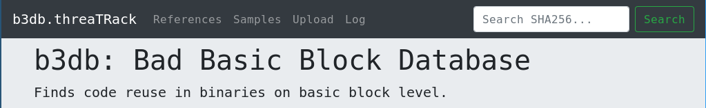
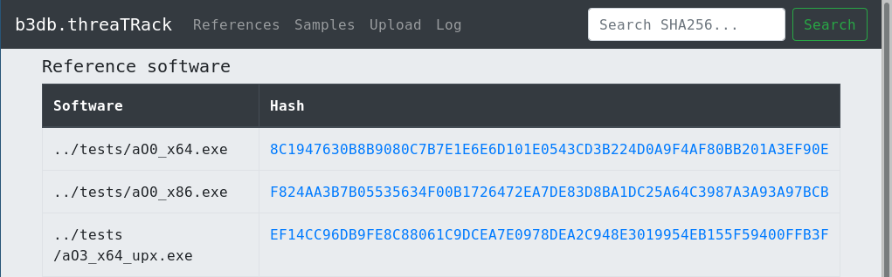
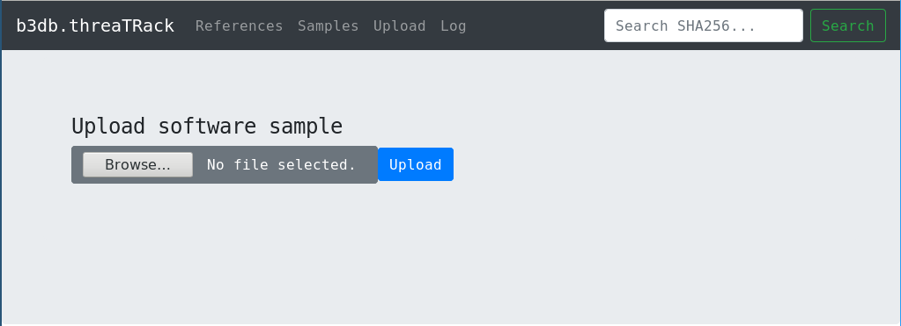
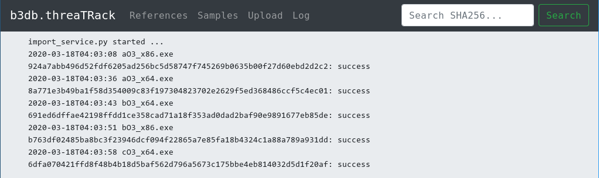
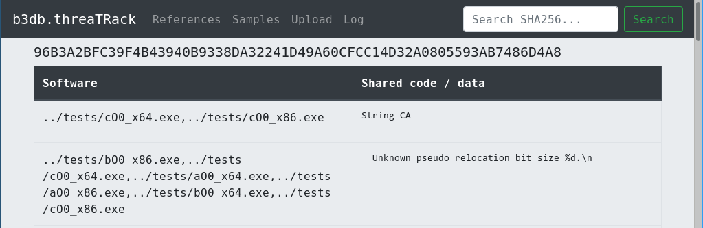
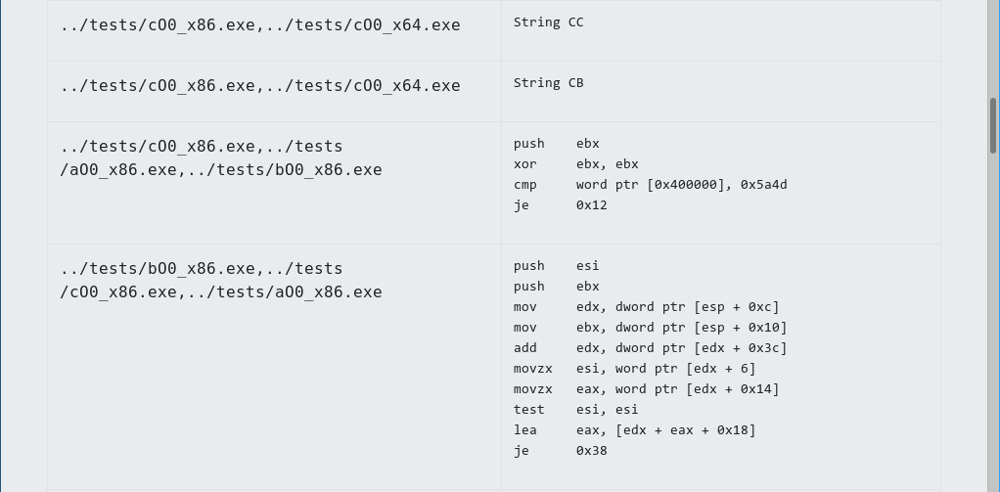
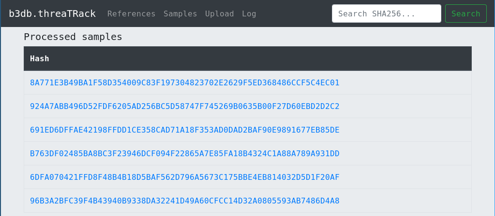

# b3db: Bad Basic Block Database



## Install

On CentOS 7 just run:

```
./el7-install.sh
```

On other systems: Do the equivalent of the `./el7-install.sh` script.
Eventually, this is planned to be moved entirely to Python and installable via pip,
so it won't require bash for setup. 

## Usage

### Config file

Edit `b2db.ini`.

### Batch import reference set from command line

Place your reference samples in the `samples` folder.
Then run:

```
for s in samples/*; do python3 b3db/extract_features.py $s; done
mysql -ub3user -p"$DATABASE_USER_PASSWORD" <<SETASREF
use b3
update bin set isref = true;
SETASREF
```

**TODO:** Allow adding uploaded samples to reference set via web app.

### Running the web service 

```
python3 app.py # runs flask app
```

And in parallel you must run:

```
python3 import_service.py 2>&1 > /home/user/b3db.log # runs importer "service"
```

### Check reference software set in web app

1. Click `References`:



These are the software samples against which the uploaded samples will be compared against.

### Check individual file against reference software set

1. Upload file:



2. Check log (written by `import_service.py`):



(It should display `<timestamp> <sample name>` after upload and a `<sample hash>: success` on successful analysis.
Otherwise the Python error output is written to the log, which you can report via an issue in this Github repo.)

3. Search for the uploaded sample's hash (top right search box):


4. Optionally, click on sample hash to get to blocks views, which displays the shared strings and assembler code:





5. Optionally, you can view all uploaded samples by clicking menu item 'Samples':



## Database stuff

## Query data base

- `/sample` view for sample with hash `8C1947630B8B9080C7B7E1E6E6D101E0543CD3B224D0A9F4AF80BB201A3EF90E`:

```
select count(*) as count, names from (
	select group_concat(distinct ref.name) as names, hex(ref.block) from (
		select name,block from bin join b2b on bin.bin = b2b.bin where bin.ref=true
	) as ref
	join b2b as test on ref.block = test.block where test.bin=unhex('8C1947630B8B9080C7B7E1E6E6D101E0543CD3B224D0A9F4AF80BB201A3EF90E')
	group by ref.block
) as res
group by res.names
order by count desc
```

- `/blocks` view for sample with hash `8C1947630B8B9080C7B7E1E6E6D101E0543CD3B224D0A9F4AF80BB201A3EF90E`:

```
select names, rep from (
	select group_concat(distinct ref.name) as names, ref.block as block from (
		select name,block from bin join b2b on bin.bin = b2b.bin where bin.ref=true
	) as ref
	join b2b as test on ref.block = test.block where test.bin=unhex('8C1947630B8B9080C7B7E1E6E6D101E0543CD3B224D0A9F4AF80BB201A3EF90E')
	group by ref.block
) as res
join block on res.block = block.block
order by block.type desc
```

### Add individual sample to reference set

- Add sample with hash `32159d2a16397823bc882ddd3cd77ecdbabe0fde934e62f297b8ff4d7b89832a` to reference set:

```
update bin set ref = true where bin=unhex('32159d2a16397823bc882ddd3cd77ecdbabe0fde934e62f297b8ff4d7b89832a');
```

**TODO: Allow adding sample to reference set via web app.**

## TODO

- Better web app UX.
- Better import service.
- Better Flask App ... so it can actually be run as a real service.
- Make API!
- Check IDA and Ghidra basic block models for compatibility to ease plugin development employing our API for basic block lookup.
- So much more...

- **If you want to help: Pull Requests are welcome!**


