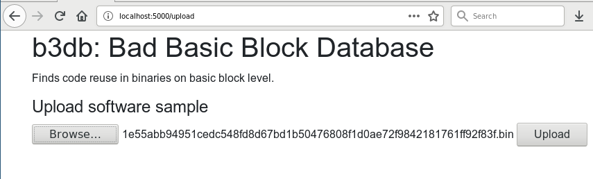
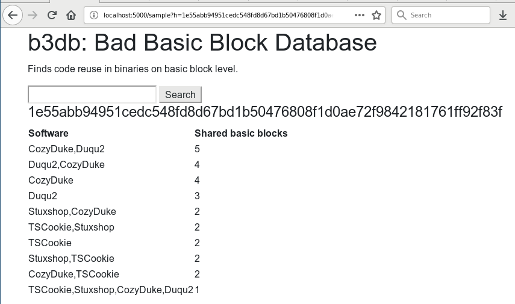

# b3db: Bad Basic Block Database

## Install

On CentOS 7 just run:

```
./el7-install.sh
```

On other systems: Do the equivalent of the `./el7-install.sh` script.
Eventually, this is planned to be moved entirely to Python and not require bash for setup. 

## Usage

### Batch import reference set

Place your reference samples in the `samples` folder.
Then run:

```
for s in samples/*; do python3 b3db/extract_features.py $s; done
mysql -ub3user -p"$DATABASE_USER_PASSWORD" <<SETASREF
use b3
update bin set ref = true;
SETASREF
```

**TODO:** Allow adding uploaded samples to reference set via Web app.

### Check individual file

1. Upload file:



2. Search for the uploaded sample's hash:




## Database stuff

## Query data base

```
select count(*) as count, names from (select group_concat(distinct ref.name) as names, hex(ref.bb) from (select name,bb from bin join bb on bin.bin = bb.bin where bin.ref) as ref join bb as test on ref.bb = test.bb where test.bin=unhex('fc11f30fb0debf8b8f42a7e9c0678df69c8b171c0038ea7aca7217b43b3c220f') group by ref.bb) as res group by res.names order by count desc;
```

### Add individual sample to reference set

```
update bin set ref = true where bin=unhex('32159d2a16397823bc882ddd3cd77ecdbabe0fde934e62f297b8ff4d7b89832a');
```

## TODO

- Make API.
- Improve Flask App (it's really bad).
- Enable string import.
- Check IDA and Ghidra basic block models for compatibility to ease plugin development employing our API for basic block lookup.
- So much more...


