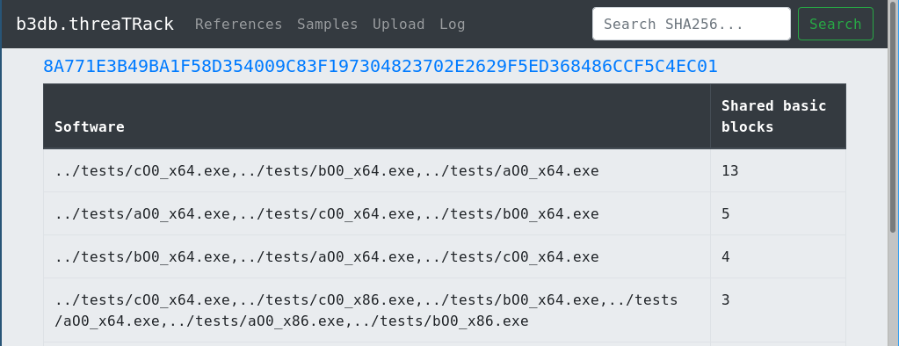

# s2db: Software Sequences Database


## Install

### On CentOS 7

Set database passwords:

```
export MYSQL_ROOT_PASS="changeme"
export S2DB_ADMIN_PASS="changeme"
export S2DB_SELECT_PASS="changeme"
export S2DB_INSERT_PASS="changeme"
```

Then run:

```
./el7-install.sh
```


### On other systems

Do the equivalent of the `./el7-install.sh` script, see [On CentOS 7] for usage of that script.
Eventually, this is planned to be moved entirely to Python and installable via pip,
so it won't require bash for setup. 

## Usage

### Config file

Edit `~/.s2db/s2db.ini`.

### Batch import reference set from command line

Place your reference samples in the `samples` folder.
Then run:

```
for s in samples/*; do python3 sequencer/sequencer.py $s; done
mysql -us2user -p"$S2DB_ADMIN_PASS" <<SETASREF
use s2db
update bin set ref = true;
SETASREF
```

### Running the web service 

```
python3 app.py # runs flask app
```

And in parallel you must run:

```
python3 import_service.py 2>&1 > ~/.s2db/upload.log # runs importer "service"
```

### Check reference software set in web app

1. Click `References`:


These are the software samples against which the uploaded samples will be compared against.

### Check individual file against reference software set

1. Upload file:


2. Check log (written by `import_service.py`):


(It should display `<timestamp> <sample name>` after upload and a `<sample hash>: success` on successful analysis.
Otherwise the Python error output is written to the log, which you can report via an issue in this Github repo.)

3. Search for the uploaded sample's hash (top right search box):



4. Optionally, click on sample hash to get to blocks views, which displays the shared strings and assembler code:


5. Optionally, you can view all uploaded samples by clicking menu item `Samples`:


## Database stuff

### Add individual sample to reference set

- Add sample with hash `32159d2a16397823bc882ddd3cd77ecdbabe0fde934e62f297b8ff4d7b89832a` to reference set:

```
update bin set ref = true where bin=unhex('32159d2a16397823bc882ddd3cd77ecdbabe0fde934e62f297b8ff4d7b89832a');
```

## TODO

- Better web app UX.
- Better import service.
- Better Flask App ... so it can actually be run as a real service.
- Make API!
- Check IDA and Ghidra basic block models for compatibility to ease plugin development employing our API for basic block lookup.
- So much more...

- **If you want to help: Pull Requests are welcome!**


